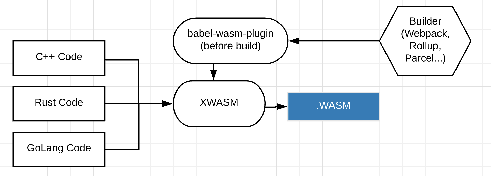

This repository contain tools for develop modern frontend with WebAssembly (React, Vue, Babel and etecetera). 

Please don't use it in production. It's not stable yet.



#### Create a project with WASM in less than 5 minutes (optional)

```
curl -o- -L https://raw.githubusercontent.com/raphamorim/xwasm/master/scripts/create-project.sh | bash
```

## Supported Languages

| Language | Status | Notes |
| :---         | :---         | :---         |
| C++   | Under development     | Still very experimental    |
| Rust     | Under development       | Test phase      |
| Go     | On Roadmap       | -      |
| Kotlin     | On Roadmap       | -      |
| Lua     | On Roadmap       | -      |

#### Summary

- [`xwasm` Packager to WebAssembly](#xwasm)
- [`useWasm` React Hook for load WASM files](#usewasm)
- [FAQ](#faq)
- [TODO](#todo)
- [References](#references)

## `xwasm`

WebAssembly Packager (understand Rust/C/C++).

It will install modules/environment on demand. However you can run separate commands to install enviroment:

- `$ xwasm install cpp` (install C/C++ required dependencies [emcc])

- `$ xwasm check cpp` (check C/C++ dependencies status)

- `$ xwasm install rust` (install Rust required dependencies [cargo])

- `$ xwasm check rust` (check C/C++ dependencies status)

#### Building with

1. Create a file: `xwasm.config.js`

```jsx
const filesToProcess = [
  {
    input: 'doubler.c',
    output: 'doubler.wasm',
    functions: ['doubler'] // functions that you want to export
  },
  {
    // by default output will follow input filename, in this case: "counter.wasm"
    input: 'counter.rs',
    functions: ['counter']  // functions that you want to export
  }
]

module.exports = filesToProcess;
```

2. Now if you run `xwasm`, it's going to load the configuration above. If you want to, you can add it before any build task. For example:

```json
"scripts": {
  "build": "xwasm && webpack",
``` 

## `useWasm`

### Installing

```bash
$ npm install use-wasm
```

### Usage

C++ code

```cpp
int _doubler(int x) {
  return 2 * x;
}
```

JSX code with React

```jsx

import React, { Fragment, Component } from 'react';
import { render } from 'react-dom';
import useWasm from 'use-wasm';

function App() {
  // method will initialize null til load the "./doubler.wasm"
  const { isWasmEnabled, instance } = useWasm('doubler');

  return (
    <Fragment>
      <p>isWasmEnabled: {String(isWasmEnabled())}</p>
      <p>_doubler: {String(instance && instance._doubler(2))}</p>
    </Fragment>
  );
}

render(<App/>, document.querySelector('#root'));

```

###### Instance loading (`null` as initial value)

 

###### Instance loaded (wasm export object as value)


## TODO

- [ ] useWasm: Cache logic for fetching WASM files
- [ ] xwasm/emscripten: Cache for build
- [ ] xwasm/emscripten: Add support for Windows
- [ ] xwasm/emscripten: Add support for load different files into one export
- [ ] Write examples using Rust 

## References

- https://webassembly.org/getting-started/developers-guide
- https://emscripten.org/docs/compiling/WebAssembly.html
- https://developer.mozilla.org/en-US/docs/WebAssembly
- https://developer.mozilla.org/en-US/docs/WebAssembly/C_to_wasm
- https://developer.mozilla.org/en-US/docs/WebAssembly/Using_the_JavaScript_API
- https://developer.mozilla.org/en-US/docs/Web/JavaScript/Reference/Global_Objects/WebAssembly/Memory
- https://github.com/emscripten-core/emscripten/issues/8126
